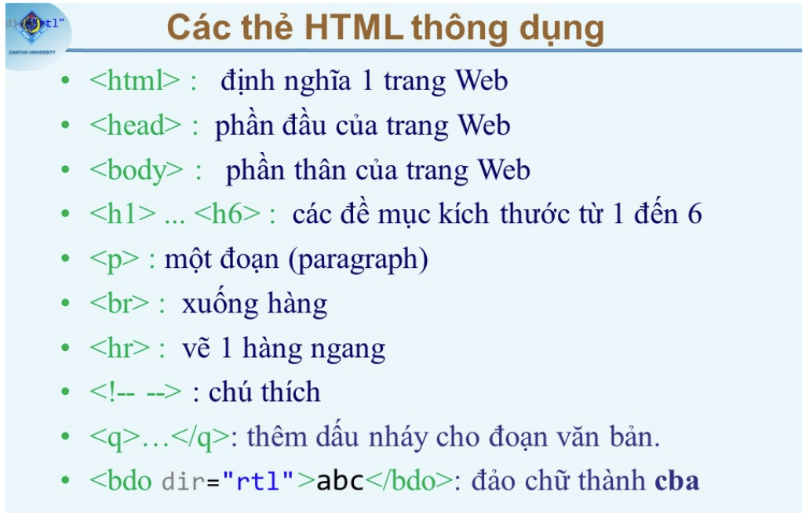
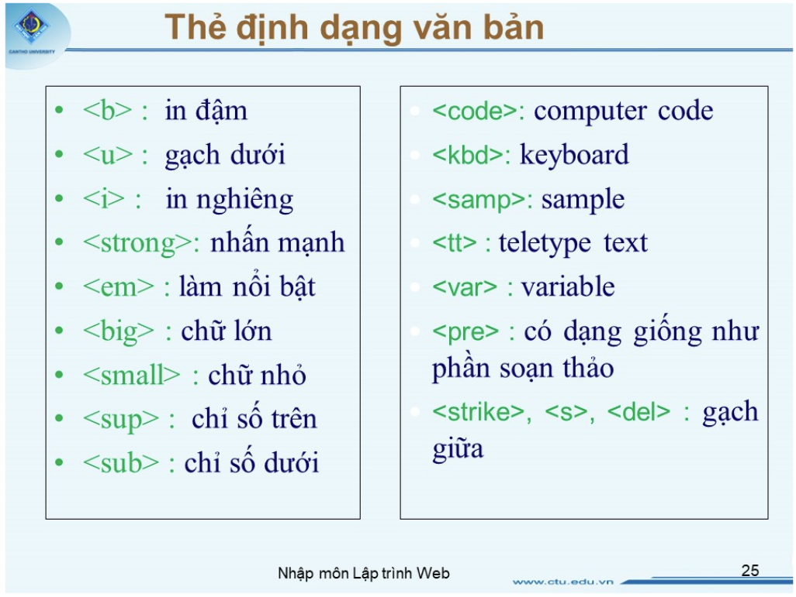
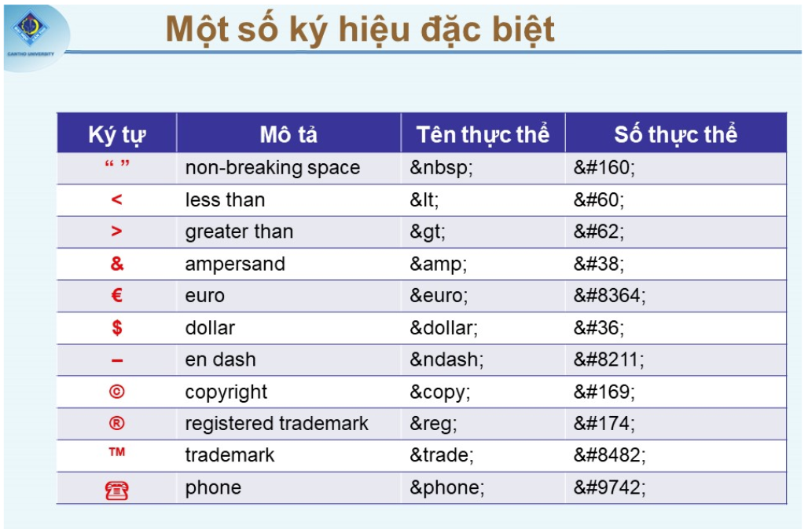
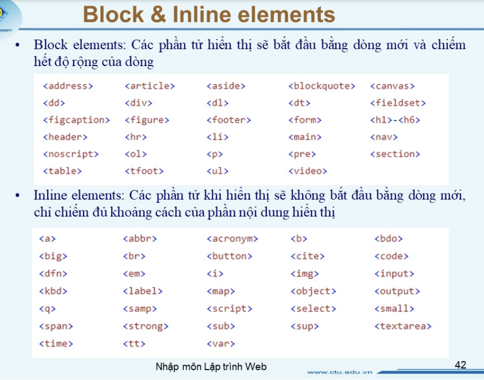
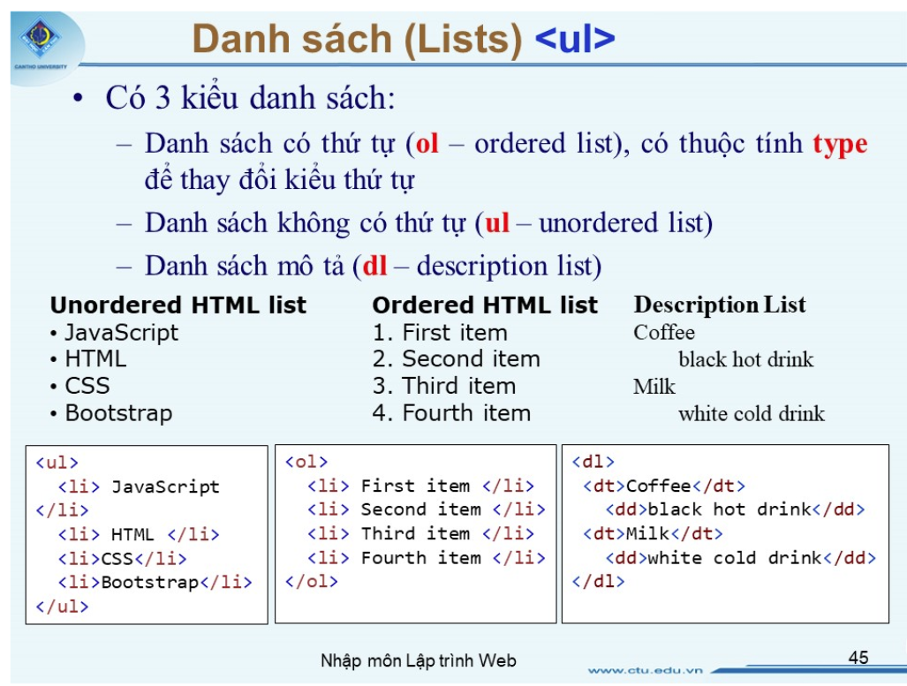

# GIỚI THIỆU HTML
## 1. Ngôn ngữ đánh dấu (Markup Language) 
- Là ngôn ngữ sử dụng các <tag> để mô tả nội dung theo cấu trúc. Ngôn ngữ dùng để định dạng nội dung. (Tiêu chuẩn W3C)
- HTML: HyperText Markup Language. _Presentation.
- XML: eXtensible Markup Language. _Structure.
- XHTML: tập con của html tương thích với xml => một phiên bản xml của html.

## 2. HTML
- `<!DOCTYPE html>` định nghĩa loại tài liệu và phiên bản html (HTML5).
-  `<html></html>` định nghĩa toàn bộ cấu trúc của trang web.
- `<head></head>` chứa thông tin mô tả của trang web.
- `<title></title>` cho biết tiêu đề trang web.
- `<body></body>` chứa nội dung hiển thị trang web trên thanh trình duyệt,...
- `<h1>...<h6>` định nghĩa tiêu đề cho nội dung.
- `
` định nghĩa nội dung văn bản.
- `<!--...-->` comment code.
- `` định nghĩa siêu liệt kết.
- `<abbr title="..."></abbr>` (abbriviation) viết tắt được đánh dấu...
- `<acronym>` giống thẻ abbr(HTML5) nhưng thẻ là phiên bản củ(HTML4) **đã bị khai tử**.
- `<address></address>` (thẻ vô vụng)
- `<applet>` (HTML4) đã khai tử thay bằng  `<object>` (HTML5)
- `<area>` chứa href tọa độ các kiểu dùng trong `<map>` trong hình ảnh khi chảm vào phần nào chứa area trên ảnh thì direct link.
- `<article></article>` Trình bày nội dung một mục.
- `<aside></aside>` được dùng mô tả đối tượng chính cảu trang. thông tin tác giả, liên kết,...
- `<header></header>` chứa nội dung phần đầu trang.
- `<footer></footer>` chứa nội dung phần chân trang.
- `<nav></nav>` chứa nội dung phần định hướng trang.
- `<section></section>` chứa một phần trang.
- `<svg></svg>` chứa các shape.
- `<canvas></canvas>` vẽ hình trên trang web dùng js.
- `<audio></audio>` định nghĩa nội dung âm thanh. Đi kèm `<source src="..." type="...">`.
- `<video></video>` định nghĩa nội dung video. Đi kèm `<source src="..." type="...">`.
- `<time></time>` định nghĩa nội dung kiểu ngày giờ.
- .... còn nhiều coi lòi l.

### Cấu trúc thẻ
- Thẻ không có thẻ đóng:  
- Thẻ có thẻ đóng: <title></title>

### Thuộc tính: (attribute)
- `width`: chiều rộng.
- `heigth`: chiều cao.
- `target`: chỉ đến tài liệu sẽ được mở. (**_self/_blank/_parent/_top**).
- `src`: địa chỉ hình ảnh, tập tin gì đó.
- ....

### Các thuộc tính chung(Global attribute)
- `accesskey` gán shortcut cho element
- `class`
- `id`
- `data-*` Do người dùng định nghĩa
- `style` 
- `contenteditable`: cho phép element có thể edit trên trình duyệt.
- `dir="rtl/ltr"`: hướng văn bản
- `draggable`: kéo thả element
- `hidden` ẩn element
- `spellcheck` yêu cầu trình duyệt kiểm tra chính tả.
- `title`
- ...

### Các thẻ thông dụng:

- `<b>` & `<strong>` giống. **Strong** nhấn mạnh nội dung trong ctrình phát ra âm thanh screen reader.
- `<i>` & `<em>` gióng, **em** nhấn mạnh nội dung trong ctrình phát ra âm thanh screen reader.

### Block & inline

### List

### Table