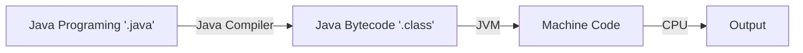

# Working of Java Program?


# JDK

- **Java Development Kit** (JDK) 
- The JDK is **a cross-platformed software development environment** that offers a collection of tools and libraries necessary for developing Java-based software applications and applets. It is a core package used in Java, along with the JVM and the JRE.	
- **JDK=JRE+Development Tools (Compiler, Debuggers, JavaDoc,  ...)**.

### Contents of JDK
The JDK has a private Java Virtual Machine (JVM) and a few other resources necessary for the development of a Java Application.
### JDK contains:
- Java Runtime Enviroment (JRE).
- An interpreter/loader (Java).
- A compiler (javac).
- An archiver (jar) and many more.

# JVM
- **Java Virtual Machine** (JVM).
-  The JVM is an abstract machine  that enables your computer to run a Java program.
- JVM is a part of JRE

# JRE
- **Java Runtime Enviroment** (JRE).
-  JRE is a software package that provides Java class libraries, JVM, and other components that are required to run Java applications.
- JRE is the superset of JVM
- **JRE = JVM + Class Libraries**

# What is Java?
### Java
- Multi Platform,...

### Feature
- Object Oriented Programming.
- Platform Independent (Nền tảng độc lập).
- Simple, Secured, Robust(mạnh), flexiable, ...
- High Performance, Multithreaded.

# 1. Java Data Type (Kiểu dữ liệu)
**Primitive data types** (kiểu dl nguyên thủy/cơ bản): 
- Boolean: boolean(1bit)
- Integer: byte(1byte), short(2byte), int(4byte), long(8byte).
- Float: float(4byte), double(4byte).
- Character: character(2byte)
**Non-Primitive data types** (kiểu dl phi nguyên thủy/tham chiếu).
- String
- Array
- List 
- Set
- Stack
- Vector
- Dictinationary
- Classes,...

# 2. Java Variables
Syntax:
`<data_type> <name_var> [=<value>];`

# 3. Java Constan (hằng luôn không thay đổi giá trị)
Systax: 
`final <data_type> <name_var> [=<value>];`

# 4. Expresstion and Operation (Biểu thức và phép toán)
- Assignment(Phép gán): `=, +=, -=, *=, /=, %=, ^=, |=, <<=, >>=, >>>=`
- Arithmetic Operation(Phép toán số học): `+, -, *, /, %`
- Logical Operation: `&&, ||`
- Unary Operation: `expr++ expr-- ++expr --expr +expr -expr ~ !`
- Shift Operation:  `<<, >>, >>>`
- Bitwise Operation: `&, ^, |`
- Relational Operation: `>, >=, <, <=, ==, !=, instanceof` 
- Ternary Operation: `? :`

**expr++ vs ++expr(expr-- vs --expr)**
```
a = 10;  (1)
b = a++; (2)
c = ++a; (3) 
```
(1): a = 10;
(2):
    b=a=10;//Gán trước
    a+1=11;//Tăng sau
(3):
    a+1=12;//Tăng trước
    c=a=12;//Gán sau

# 5. Type Casting (Ép kiểu)
- Implicit type casting(Ép kiểu tự động/ngầm định):
`byte` -> `short` -> `char` -> `int` -> `long` -> `float` -> `double`

- Explicit type casting(Ép kiểu tường minh):
`double` -> `float` -> `long` -> `int` -> `char` -> `short` -> `byte`
syntax:
```
    <varA> = (dataType)<varB> 
```

# 6. Input/Output (Nhập và In)
**Input**
Using `Scanner` class.
```
    import java.util.Scanner;//import lớp Scanner
    ....
    Scanner <name_var> = new Scanner(System.in);//Khởi tạo 
    <name_other_var> = <name_var>.<method....>;
```
Input tyoes
- nextBoolean();
- nextByte();
- nextDouble();
- nextFloat();
- nextInt();
- nextLine();
- nextLong();
- nextShort();

**Output**
```
    System.out.print(<string>);//không xuống dòng
    System.out.println(<string>);//xuống dòng
```

# 7. Java Decision Making Statements (Cấu trúc điều khiển)
- if else: 
- switch: 
(Tương tự trong C/C++)

# 8. Java Loop Statements
- for loop
- do while loop
- while loop
- for-each loop 
```
    for (type variableName : arrayName) {
    // code block to be executed
    }
```

# 9. Break, Continue, Return
- Break: the loop is immediately terminated.
- Continue: Skip the current loop.
- Return: Shutdown function

# 10. Java Method-Function (Phương thức)
Method is function!!
```
public <Datatype> <nameMethod> (Parameters) {
    ....codes
}

public static <Datatype> <nameMethod> (Parameters) {
    ....codes
}
```

***Note***:
- A method must be called from an object.(Một phương thức phải được gọi từ một đối tượng).
- A static method can be called either form an object or the class name.(Phương thức tĩnh có thể được gọi từ một đối tượng hoặc tên lớp).
- However, a static method can only be called and accessed from the static method.(Tuy nhiên phương thức tĩnh chỉ được gọi và truy xuất phương thức tính).
- Regular functions can call static methods.(Hàm bình thường có thể gọi hàm tỉnh).
- The atatic methods cannot call regular functions.(Hàm tĩnh không thể gọi hàm bình thường).

# 11. Overloading (Tái định nghĩa)
Multiple methods can have **the same name** as long as **the number** and/or **type** of parameters are **different**.
- Change type of parameters.
- Change the number of parameters.
- Sort parameters.

**Note: Vague Error/Ambiguous Error**
Khi một lời gọi hàm mà có 2 hoặc nhiều hàm đáp ứng thì sẽ tạo ra lỗi gọi là **Lỗi Mơ Hồ**