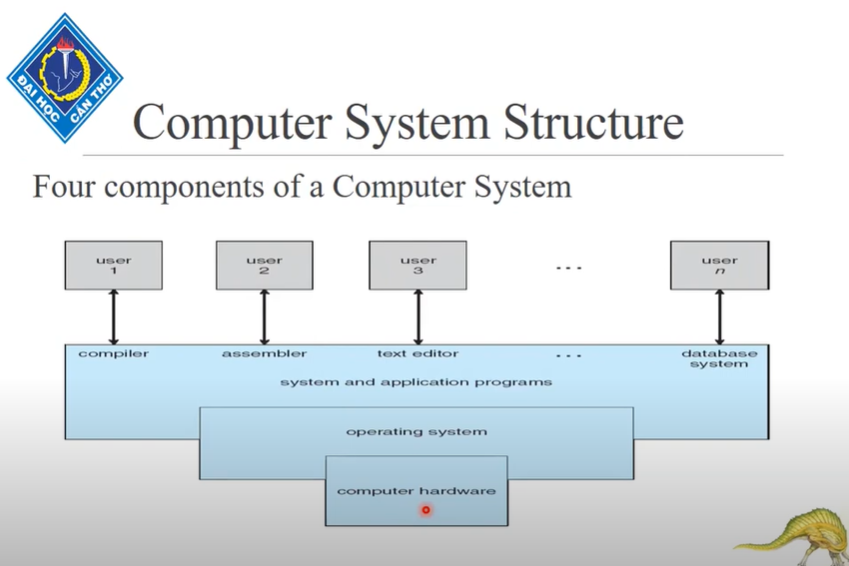
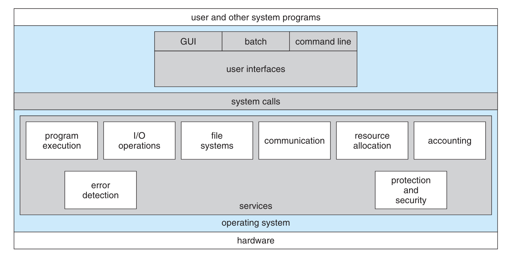
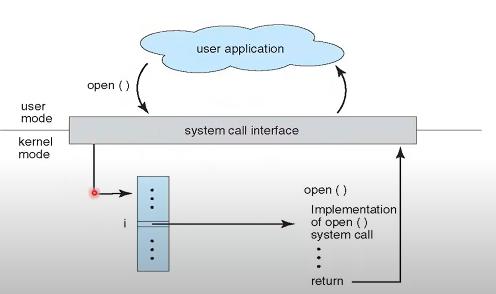
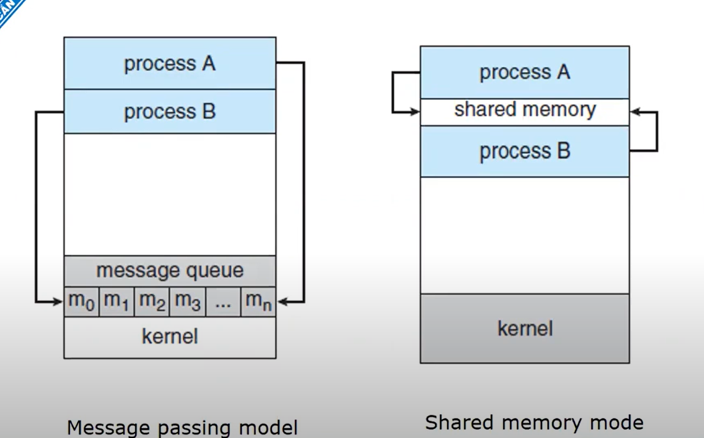
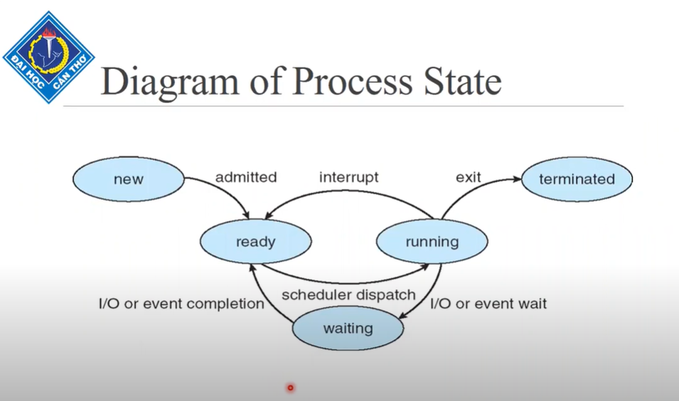
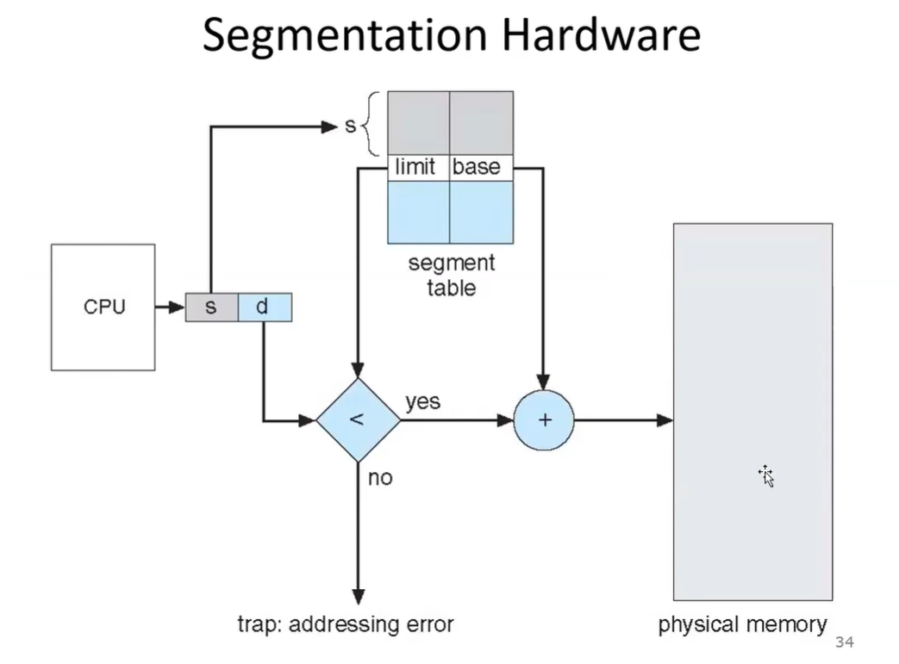

# CHAPPTER 1: INTRODUCTION

## I. Cấu trúc của một hệ thống máy tính:
#### Có 4 thành phần trong hệ thống máy tính:
- Phần cứng (hardware): cung cấp tài nguyên CPU, I/O,...
- Hệ điều hành (Operating System): Quản lí tài nguyên phần cứng (**OS là phần mềm**).
- Các chương trình(Ctrinh hệ thống và Ctrinh Ứng dụng): Sử dụng tài nguyên hệ thống.
- Đối tượng người dùng: nhu cầu tính toán làm việc với ctrinh máy tính.

#### Hệ điều hành ?
- Hệ thống máy tính gồm phần cứng và phần mềm: OS Là phần mềm.
- Nằm phía bên trên phần cứng.
- Nằm dưới các ctrinh hệ thống.

#### User interface program: chia 2 loại
- **GUI**: Giao diện đồ họa. (Graph user interface).
- **CLI**: Giao diện dòng lệnh. (Command line interface).

#### Định nghĩa hệ điều hành
- Bộ cấp phát tài nguyên (Quản lí cả khgian và thgian...tiến trinh nào dùng vùng nhớ nào tại tgian nào).
- Chương trình điều khiển (Quản lí điều khiển toàn bộ hệ thống ... cho phép thì ctrinh mới làm đc nhé -> Ngăn chặn lỗi xãy ra).
- Máy tính mở rộng (Che phủ những tính toán phứt tạp bên dưới hệ thống)

#### Kernel ?
- Kernel là ctrinh chạy toàn phần trong hệ thống từ khi mở máy.

#### USER MODE(tất cả gì trong hệ thống máy đều chạy ở user mode)/ KERNEL MODE(chế độ nhân lõi chỉ duy nhất hệ điều hành chạy)
- Khi ra lệnh ta ở UM 
- Để truy xuất thao tác với phần cứng chuyển qua Kernel Mode
- Để kết quả từ phần cứng đến người dùng chuyển qua User Mode

#### Các cách Transition usermode/kernelmode
- interrupt(phần cứng): nếu hardware request OS services(tất cả gì sài trên máy đều là dịch vụ của OS).
- trap(chương trình): Ctrinh người dùng yêu cầu OS.
- exception: ngoại lệ lỗi đồ đó.

#### Computer Starup
- Bootstrap program: (ngòi lửa)
- Khi ấn nút nguồn -> Bootstrap kích hoạt (định vị kernel hđh đang nằm đâu) -> nạp kernel vào memory -> starup kernel hđh
- Khi kernel của hệ điều hành vận hàng -> Nhường quyền đkhiển cho HĐH.

- Tất cả dữ liệu, tài nguyên lưu bất kì đâu trên máy muốn sử dụng thì phải được nạp vao memory.
- OS kernel luôn nằm trong memory nhé.

#### Storage-Device Hierarchy
- Tốc độ giảm dần , Dung lượng tăng dần:
- **Registers**
- **cache**
- **main memory**
- **disk** (electronic disk -> magnetic disk -> optical disk).
- **magnetic tapes**

#### CSA (Computer System Architecture - kiến trúc hệ thống máy tính)
- Đơn xử lí
- Đa xử lí: (Ưu điểm: )

#### Hệ thống đa xử lí
- AMP(Bất đối xứng): có processer làm boos quản lí(ƯĐ: phân chia công việc; NĐ: boss hỏng -> tới công chuyện)
- SMP(Đối xứng): Phân chia kh đồng đều dẫn đến 1 hệ thống nhàn rỗi hay quá tải
#### Multicore hay Multichip hiệu quả hơn?
- Multicore oke hơn: 2 người 1 phòng oke hơn 1 người 1 phòng

#### Hệ thống cụm: Yêu cầu kết nối mạng
- Cụm đối xứng
- Cụm bất đối đối xứng: kh có boos nhưng có 1 máy tính ở chế độ **hot-standby**(Luôn sẳn sàng thay thế khi có máy bị fail - giống kiểu dự bị).

#### Cấu trúc OS
- Hệ thống bó
- Hệ thống đa chương(chương trình)
- Hệ thống Timesharing

- Các thành phần: Process management/Memory management/File and Storage/Networking

# CHAPPTER 2: OPERATING SYSTEMS STRUCTURE

### Dịch vụ hệ điều hành:
- Bộ cấp phát tài nguyên
- Accounting (Kiểm toán): lưu lại người dùng đã dùng tài nguyên nào và bao nhiêu.
- Protection: nội bộ, đảm bảo truy cập nội bộ bên trong hệ thống.
- Security: ngoại bộ, tiến trình bên ngoài muốn tham gia thì phải được chứng thực
- ...

### System call(lời gọi hệ hống): gọi các dịch vụ của OS
- Viết bằng ngôn ngữ cấp cao: C,...
- Gọi thông qua các API

- Gọi qua systemcall

- User dùng hàm open() từ system call chuyển user mode->kernel mode tìm các mã lệnh open() => thực thi trả kết quả kernel mode->user mode thông qua system call interface đến user.

### Truyền tham số system call (3 phương pháp)
- Truyền vào thanh ghi.
- Lưu vào trong các block hoặc table bên trong memory.(địa chỉ vùng nhớ nơi lưu trữ quăng vào thanh ghi)
- Đưa vào stack(push/pop).

### Trao đổi các tiến trình
- **Tiến trình**: Một ctrinh thực thi sẽ sinh ra 1 hoặc nhiều tiến trình.
- PP1: [Truyền thông điệp] bên gửi dùng send(), bên nhận dùng receive(), Cần 1 kệnh truyền nối kết bên gửi và bên nhận.
- PP2: [Sử dụng vùng nhớ chung chia sẽ] Dành ra vùng nhớ chung, đưa dữ liệu vào vùng nhớ nếu muốn share.

### MS-DOS: hệ điều hành đơn nhiệm
### Layered Approach: phân tầng
- Tầng thấp nhất: phần cứng
- Tầng cao nhất: giao diện người dùng
- Tầng trên sử dụng dịch vụ tầng dưới cung cấp
- ƯĐ: Mỗi tầng có 1 dv riêng; tầng trên cần sài tầng dưới có liền;-> KHi bị lỗi xác định rất oke
- NĐ: Cực kì phứt tạp->Thực hiện được sửa lỗi master luôn

### Microkernel: Vi nhân
- Ý tưởng: Đưa nhiều nhất  ó thể những gì có ở kernel mode lên user mode
- Thực tế khi ctrinh thực thi -> tạo các tiến trình -> Các tiến trình giao tiếp với nhau -> Về lại kernel :> Ý tưởng fail

### Modules
- Sài thì thiết kế thêm modules
- Không sài thì remove

# CHAPPTER 3: PROCESS
### Tiến trình: được tạo ra khi chương trình thực thi
### A process include:
- program counter: lưu giữ chỉ thị lệnh kế tiếp thực thi
- stack
- data section

### State
- **new**: một tiến trình vừa được tạo ra trạng thái new
- **running**: đã được cấp phát cpu để thực thi
- **waiting**: tiến trình đợi sự kiện nào đó xảy ra
- **ready**: một tiến trình được cấp phát đầy đủ ngoại trừ cpu
- **terminated**: khi tiến trình hoàn thành xong công việc

- Tiến trình đi tuần tự theo cái sơ đồ.
- Tại 1 thời điểm có thể có nhiều trạng thái new.
- Tại 1 thời điểm có thể có nhiều trạng thái ready.
- (Giả sử hệ thống chỉ có 1 bộ sử lí) Tại 1 thời điểm chỉ có 1 trạng thái running.
- Có thể có nhiều tiến trình ở trạng thái waiting
### Khối điều khiển tiến trình PCB Process control block (lưu các tiến trình)
### Chi phí chuyển ngữ cảnh
- Trước khi trả CPU tiến trình lưu thông tin -> tốn chi phí(Lấy CPU lại sẽ nạp vào để thực hiện tiếp).

### Hàng đợi
- Job queue: tập hợp các tiến trình trong hệ thống
- Ready queue: tập hợp các tiến trình đang nằm trong bộ nhớ, sẳn sàng và chờ thực thi
- Device queues: tập hợp các tiến trình đang đợi sử dụng thiết bị vào ra gì đó.

### Định thời
- Long-tern scheduler: thời gian thực thi lâu, lâu lâu mới gọi, khống chế mức độ đa chương(khống chế số lượng đưa vào hang đợi ready);
- Short-tern scheduler: thời gian thực thi mau, gọi thường xuyên.

### Vấn đề tiến trình cha con
#### 1. Chia sẽ tài nguyên
- Share all
- Share 1 phần
- không share

#### 2. Tiến trình cha/con tiến trình nào kết thúc trước?

# CHAPTER 4: CPU SCHEDULING
### CPU Burst: khoảng thời gian chiếm dụng CPU

### 2 Dạng định thời
- non-preemptive: không trưng dụng
- preemptive: trưng dụng

- Độ trễ điều phối: Dispath latency

### Turnround time: Tính từ khi tiến trình đến hệ thống cho đến khi hoàn thành xong công việc.
### Waiting time: Tổng thời gian 1 tiến trình ở trong hàng đợi ready
### Response time: Thời gian lần đầu được gọi.

### Các thuật toán
- FIFS (không trưng dụng): tiến trình ciheems dụng cho đến xong
- SJF (trưng dụng/không trưng dụng): tiến trình CPU time nhỏ làm trước
- PS (trưng dụng/không trưng dụng): Xét theo độ ưu tiên
- RR (trưng dụng): : Xét mỗi lần chỉ dùng q CPU time

# CHAPTER 5: 
### ĐK tranh đua: 2 hay nhiều tiến trình đồng thồi tác động lên vùng dùng chung chia sẽ-> kg = cuối cùng
### Miền tương trục là miền xãy ra đk tranh đua

# CHAPTER 6: DEADLOCk
### Banker's Algorithrm
- B1 work = available
- B2 Xet Need(p)<=work> -> work + allocation(p)
##### **Nếu có request p**
- Xét xem request <= need(p) => nếu sai thì lỗi
- Xét xem request <= available => nếu sai thì đợi cấp đủ tài nguyên
- ĐK đúng: update 
- (o) available += request;
- (o) allocation += request;
- (o) need += request;
- Sau đó làm như trên là OKE

### Detection Algorithrm
- B1: Request < work -> Sai thì có deadlock
- B2: work+=request

# CHAPTER 7: MAIN MEMORY

### Các khái niệm
- Hole - block of avalable memory

### Cấp phát vùng nhớ (BÀI TẬP)
- FIRST_FIT (đủ là cấp, đi theo thứ tự)
- BEST_FIT (đủ và dung lượng nhỏ nhất, đi theo thứ tự)
- WORST-FIT (đủ và dung lượng lớn nhất, đi theo thứ tự)

### Fragmentation (Phân mãnh)
- Phân mảnh ngoài: Còn đủ bộ nhớ cấp phát đó nhưng mà nó rời rạc (VD: 500kb nhưng chia thàng 3 vùng 100kb 200kb 200kb,...)
- Phân mảnh trong: Tiến trình yêu cầu mà mình cấp *hơn chút xíu* (VD: yêu cầu 300kb mà đang có 302kb thì cấp luôn 302 để đỡ quản lí 2kb thừa thải và hầu như không sài tới).

### Segmentation Architecture
- (o) Base (số đầu tiên - số ghế muốn ngồi)
- (o) Limit (giới hạn - giới hạn bao nhiêu ghế)
- (o) Base <= Địa chỉ hợp lệ < Base+Limit
- 