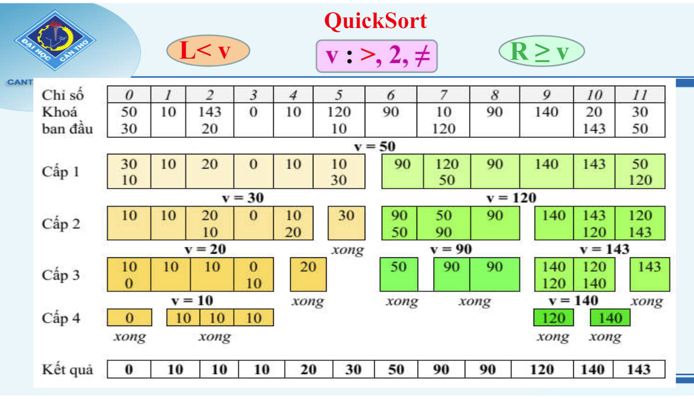
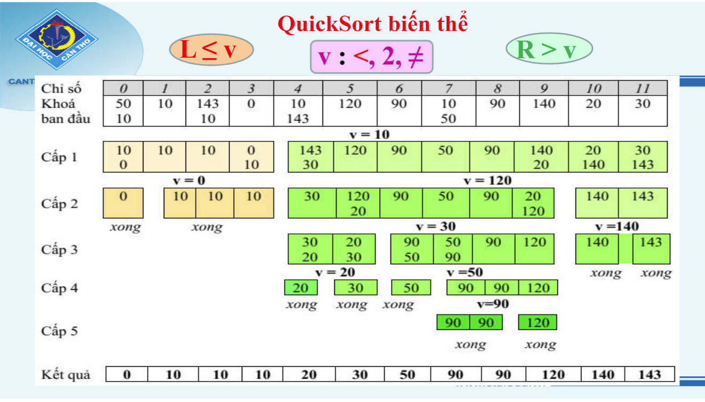
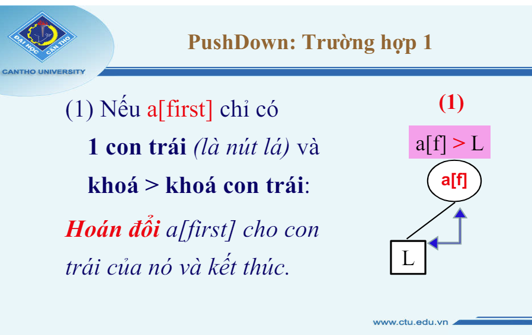
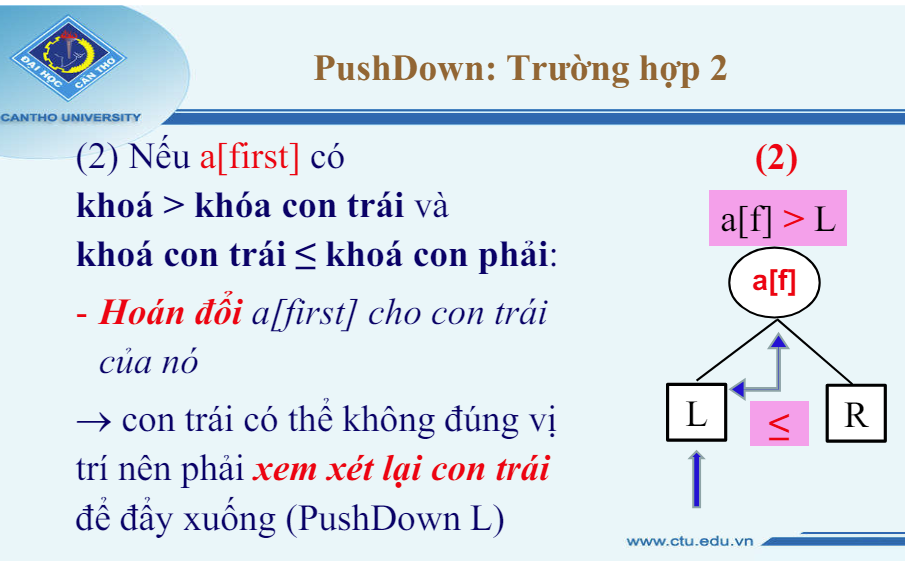
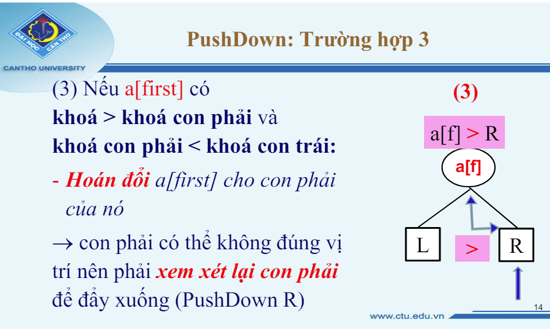

# CHƯƠNG 1: ĐỘ PHỨT TẠP THUẬT TOÁN
## 1. Sắp xếp độ phứt tạp
#### Định nghĩa Algorithmic Complexity: 

#### So sánh:
- Hằng: O(1)
- Logaric: O(logn) 
- Tuyến tính: O(n)
- Loga tuyến tính: O(nlogn)
- Đa thức: O(n^c)
- Mũ: O(C^a)
- Lũy thừa: O(n!)

## 2. Chương trình không có đệ quy (QTC, QTN)
- Tính độ phút tạp dựa trên code

## 3. Chương trinhg có đệ quy(Truy hồi/Tổng quát)
- Thành lập phtrinh và tính độ phứt tạp

# CHƯƠNG 2: SẮP XẾP
## 1. Các thuật toán sắp xếp đơn giản O(n^2)
### Selection Sort:
- Ý tưởng:
##### Chọn phần tử nhỏ nhất trong n phần tử ban đầu, đưa phần tử này về vị trí đúng là vị trí đầu tiên của mảng hiện hành. Sau đó không quan tấm đến nó nữa, xem mảng hiện hành chỉ còn n-1 phần tử của mảng ban đầu. Bắt đầu từ vị trí thứ 2, lặp lại quá trình trên cho mảng hiện hành đến khi chỉ còn 1 phần tử.
##### Do mảng ban đầu có n phần tử, vậy tóm tắt ý tưởng thuật toán là thực hiện n-1 lượt việc đưa phần tử nhỏ nhất trong mảng hiện hành về vị trí đúng ở đầu mảng.
- Giải thuật: 
##### **B1:** Chọn phần tử có khóa nhỏ nhất trong n phần tử từ a[0] đến a[n-1] và hoán vị nó với phần tử a[0].
##### **B2:** Chọn phần tử có khóa nhỏ nhất trong n-1 phần tử từ a[1] đến a[n-1] và hoán vị nó với a[1]. 
##### **Tổng quat bước i:** chọn phần tử có kháo nhỏ nhất trong n-i phần tử từ a[i] đến a[n-1] và hoán vị nó với a[i];
##### **Bn-1:** Mảng đã được sắp xếp.
- Minh họa:
#### Sắp Xếp giảm dần dãy: 5 6 2 2 10 12 9 10 9 3
|    | a0 | a1 | a2 | a3 | a4 | a5 | a6 | a7 | a8 | a9 |
|----|----|----|----|----|----|----|----|----|----|----|
| BĐ |  5 |  6 |  2 |  2 | 10 | 12 |  9 | 10 |  9 |  3 |
| B1 |  **2** |  6 |  **5** |  2 | 10 | 12 |  9 | 10 |  9 |  3 |
| B2 |    |  **2** |  5 |  **6** | 10 | 12 |  9 | 10 |  9 |  3 |
| B3 |    |    |  **3** |  6 | 10 | 12 |  9 | 10 |  9 |  **5** |
| B4 |    |    |    |  **5** | 10 | 12 |  9 | 10 |  9 |  **6** |
| B5 |    |    |    |    |  **6** | 12 |  9 | 10 |  9 | **10** |
| B6 |    |    |    |    |    |  **9** | **12** | 10 |  9 | 10 |
| B7 |    |    |    |    |    |    |  **9** | 10 | **12** | 10 |
| B8 |    |    |    |    |    |    |    | **10** | 12 | 10 |
| B9 |    |    |    |    |    |    |    |    | **10** | **12** |
| KQ |  **2** |  **2** |  **3** |  **5** |  **6** |  **9** |  **9** | **10** | **10** | **12** |

#### Ngoài lề: Không phụ thuộc tình trạng của mảng ban đầu O(n^2).

 

### Insertion Sort:
- Ý tưởng: 
##### Bắt chước xếp các quân bài của những người chơi bài. Muốn sắp xếp một bộ bài theo tuần tự, người chơi bài rút lần lượt từ quân bài thứ 2, so với các quân đứng ở trước nó để chèn vào vị trí thích hợp.
#### Xét mảng gồm k phần tử đầu. Với i=1, mảng gồm một phần tử đã được sắp. Giả sử trong mảng i-1 phần tử đầu đã được sắp, để sắp xếp một phần tử ta tìm vị trí thích hợp của nó trong mảng. Vị trí thích hợp đó là đứng trước phần tử lớn hơn nó và sau phần tử nhỏ hơn hoặc bằng nó.

- Giải thuật:
##### **B1:** Xen phần tử a[1] vào danh sách đã có thứ tự a[0] sao cho a[0], a[1] là danh sách có thứ tự.
##### **B2:** Xen phần tử a[2] vào danh sách đã có thứ tự a[0], a[1] sao cho a[0], a[1], a[2] là danh sách có thứ tự.
##### **Tổng quat bước i:** Xen phần tử a[i] vào danh sách đã có thứ tự a[0], a[1], a[2], ..., a[i-1] sao cho a[0], a[1], a[2], ..., a[i-1], a[i] là danh sách có thứ tự.
##### **Bn-1:** Mảng đã được sắp xếp.

- Minh họa
#### Sắp Xếp giảm dần dãy: 5 6 2 2 10 12 9 10 9 3
|    | a0 | a1 | a2 | a3 | a4 | a5 | a6 | a7 | a8 | a9 |
|----|----|----|----|----|----|----|----|----|----|----|
| BĐ |  5 |  6 |  2 |  2 | 10 | 12 |  9 | 10 |  9 |  3 |
| B1 |  5 |  **6** |    |    |    |    |    |    |    |    |
| B2 |  **2** |  5 |  6 |    |    |    |    |    |    |    |
| B3 |  2 |  **2** |  5 |  6 |    |    |    |    |    |    |
| B4 |  2 |  2 |  5 |  6 | **10** |    |    |    |    |    |
| B5 |  2 |  2 |  5 |  6 | 10 | **12** |    |    |    |    |
| B6 |  2 |  2 |  5 |  6 |  **9** | 10 | 12 |    |    |    |
| B7 |  2 |  2 |  5 |  6 |  9 | 10 | **10** | 12 |    |    |
| B8 |  2 |  2 |  5 |  6 |  9 |  **9** | 10 | 10 | 12 |    |
| B9 |  2 |  2 |  **3** |  5 |  6 |  9 |  9 | 10 | 10 | 12 |
| KQ |  **2** |  **2** |  **3** |  **5** |  **6** |  **9** |  **9** | **10** | **10** | **12** |
#### Ngoài lề: Phụ thuộc tình trạng của mảng ban đầu (Tại while có thể O(1)).
 

### Buble Sort:
- Ý tưởng: 
##### Xuất phát từ cuối (or đầu) mảng, đổi chổ các cặp phần tử kế cận để đưa phần tử nhỏ(lớn) hơn trong cặp phần tử đó về vị trí đứng đầu(cuối) mảng hiện hành. Sau đó sẽ không xét đến nó ở vị trí tiếp theo, do vậy ở lần xử lý thứ i sẽ có vị trí đầu mảng là i. Lặp lại xử lý trên cho đến khi không còn cặp phần tử nào để xét. 

- Giải thuật:
##### **B1:** Xét a[j] (j giảm từ n-1 đến 1), so sanh khóa của a[j] với khóa của a[j-1]. Nếu a[j] < a[j-1] thì đổi a[j] và a[j-1]. Sau bước này thì a[0] có khóa nhỏ nhất.
##### **B2:** Xét a[j] (j giảm từ n-1 đến 2), so sanh khóa của a[j] với khóa của a[j-1]. Nếu a[j] < a[j-1] thì đổi a[j] và a[j-1]. Sau bước này thì a[1] có khóa nhỏ thứ 2.
##### ....
##### **Bn-1:** Mảng đã được sắp xếp.
- Minh hoạ: 
#### Sắp Xếp giảm dần dãy: 5 6 2 2 10 12 9 10 9 3
|    | a0 | a1 | a2 | a3 | a4 | a5 | a6 | a7 | a8 | a9 |
|----|----|----|----|----|----|----|----|----|----|----|
| BĐ |  5 |  6 |  2 |  2 | 10 | 12 |  9 | 10 |  9 |  3 |
| B1 |  **2** |  5 |  6 |  2 |  3 | 10 | 12 |  9 | 10 |  9 |
| B2 |    |  **2** |  5 |  6 |  3 |  9 | 10 | 12 |  9 | 10 |
| B3 |    |    |  **3** |  5 |  6 |  9 |  9 | 10 | 12 | 10 |
| B4 |    |    |    |  **5** |  6 |  9 |  9 | 10 | 10 | 12 |
| B5 |    |    |    |    |  **6** |  9 |  9 | 10 | 10 | 12 |
| B6 |    |    |    |    |    |  **9** |  9 | 10 | 10 | 12 |
| B7 |    |    |    |    |    |    |  **9** | 10 | 10 | 12 |
| B8 |    |    |    |    |    |    |    | **10** | 10 | 12 |
| B9 |    |    |    |    |    |    |    |    | **10** | 12 |
| KQ |  **2** |  **2** |  **3** |  **5** |  **6** |  **9** |  **9** | **10** | **10** | **12** |
#### Ngoài lề: Không phụ thuộc tình trạng của mảng ban đầu O(n^2).

## 2. Các thuật toán sắp xếp phứt tạp O(nlogn)
### Quick sort:
- Ý tưởng: dùng "Chia để trị"
##### **B1:** Chọn một phần tử khóa v làm phần tử chôt(pivot)
##### **B2:** Phân hoạch dãy a[0]...a[n-1] thành 2 mảng con "bên trái" và "bên phải". Mảng con "bên trái" bao gồm các phần tử có khóa nhỏ hơn chốt. Mảng con "bên phải" bao gồm các phần tử có khóa lớn hơn hoặc bằng chốt.
##### **B3:** Sau khi phân hoạch thành 2 mảng, thực hiện lại bước 2 ở từng mảng - chọn pivot ở từng mảng và tiếp tục phân chia thành các mảng nhỏ hơn, sắp xếp đến khi mảng được sắp xếp hoàn toàn (Mảng gồm 1 phần tử hoặc gồm nhiều phần tử có khóa bằng nhau thì đã có thứ tự).
- Phương pháp chọn chốt (**o**):
##### Chọn giá trị khóa lớn nhất trong hai phần tử có khóa khác nhau đầu tiên từ trái qua.
##### Nếu mảng chỉ có 1 phần tử hoặc các phần tử có khóa bằng nhau thì không có chốt.
##### `VD: 6 6 4 5 8 7 -> Chốt là 6 tại vị trí đầu.`
##### `VD: 6 6 7 5 8 7 -> Chốt là 7 tại vị trí 3.`
##### `VD: 6 6 6 6 6 6 -> Không có chốt do các phần tử có khóa bằng nhau.`
##### `VD: 6           -> Không có chốt do mảng chỉ có một phần tử.`
- Cách phân hoạch (**o**):
##### Để phân hoạch mảng dùng 2 "con nháy" L và R, trong đó L đi từ bên trái và R đi từ bên phải
##### Cho L chạy **sang phải** tới khi gặp phần tử có `khóa >= chôt`. 
##### Cho R chạy **sang trái** tới khi gặp phần tử có `khóa < chôt`. 
##### Tại chổ dừng của L và R: Nếu `L<R` thì hoán vị a[L] và a[R].
##### Lặp lại quá trình dịch sang phải, sang trái của 2 "con nháy" L và R cho đến khi `L>R`.
##### Khi đó L sẽ là điểm phân hoạch, cụ thể là a[L] là phần tử đầu tiên của mảng con "bên phải"
- Giải thuật: 
##### Để sắp mảng a[i]...a[j] ta làm như sau:
##### - Xác định chốt trong mảng a[i]...a[j].
##### - Phân hoạch mảng a[i]...a[j] đã cho thành hai mảng con a[i]...a[k-1] và a[k]...a[j].
##### - Sắp xếp mảng a[i]...a[k-1] (đệ quy).
##### - Sắp xếp mảng a[k]...a[j] (đệ quy).
##### Đệ quy sẽ dừng khi không tìm thấy chốt.
- Minh họa:
 

### Quick sort biến thể
##### Chọn chốt là khóa của phần tử `nhỏ nhất` trong 2 phần tử khóa khác nhau đầu tiên từ trái qua.
- Các phần tử bên trái: L <= v (v là chốt).
- Các phần tử bên phải: R > v 
##### Minh họa:

##### So sánh QuickSort và QuickSort biến thể:
- Quick sort    : `L <  v`   `v:>,2,!=`  `R >= v` 
- Quick sort bt : `L <= v`   `v:<,2,!=`  `R >  v`

### Heap sort
#### + Heap: là cây sắp xếp thứ tự bộ phận (Cây nhị phân, giá trị nút (khác nút lá) nhỏ hơn giá trị các nút con của nó).
#### + Nhận xét: `Nút gốc` có giá trị nhỏ nhât, Heap không phải `cây tìm kiếm nhị phân`.

#### Thuật toán: 
##### B1: Xem mảng là cây nhị phân:
##### ---------: a[0] là nút gốc.
##### ---------: a[i] có con trái a[2i+1], con phải a[2i+2].
##### ---------: Nút trong(a[0]....a[(n-2)/2]) đều có 2 con. (Trừ a[(n-2)/2] có thể có 1 con nếu n chẵn).
##### B2: Sắp xếp cây HEAP: Thủ tục PushDown.
##### B3: Hoán đổi nút gốc a[0] cho nút lá cuối.
##### B4: Sắp xếp lại cây sau khi đã bỏ nút lá cuối thành HEAP mới dùng PushDown -> Lặp lại B3 & B4 cho đến khi cây chỉ còn 2 nút.
##### => 2 nút này và các nút lá bỏ ra tạo thành thứ tự giãm dần.

- Quy tắc pushdown:
##### Nhận 2 tham số là **first** và **last** để đẩy nút **first** xuống.
##### Giả sử cây a[first],...a[last] đã đúng vị trí của một HEAP trừ a[first]: PushDown sẽ đẩy a[first] xuống đúng vị trí của nó trong cây.
##### Khả năng có thể của a[first].
##### -------: TH1: Nếu a[first] chỉ có `1 con trái` là lá & `khóa > khóa con trái` thì hoán đổi a[first] & a[con trái].
.
##### -------: TH2: Nếu a[first] chỉ có `khóa > khóa con trái` và `khóa con trái <= khóa con phải` thì hoán đổi a[first] & a[con trái]. Sau đó pushdown tiếp con trái.
.
##### -------: TH2: Nếu a[first] chỉ có `khóa > khóa con phải` và `khóa con phải < khóa con trái` thì hoán đổi a[first] & a[con phải]. Sau đó pushdown tiếp con phải.
.

- Minh họa:
##### 1. Tree (Không thi). -> vẽ cây
##### 2. Array (Thi). -> kẻ bảng

# CHAPTER 3:

# CHƯƠNG 4: LƯU TRỮ NGOÀI
## 1. Định nghĩa và tính chất của B-cây.(Balanced tree)
### Định nghĩa: B-tree bậc m là `Cây tìm kiếm m phân cân bằng`.
#### `m`: số con tối đa của nút trong.
#### `b`: số mẫu tin tối đa của nút lá.

### Tính chất(4):
- Nút gốc hoặc là lá hoặc có ít nhất 2 nút con.
- Mỗi nút trong có từ ceil(m/2) đến m nút con.
- Các đường đi từ gốc đến lá có cùng độ dài.
- Các khóa và cây con sắp xếp theo **cây tìm kiếm**

## 2. Xen và xóa mẫu tin trong B-tree
### Xen mẫu tin
#### > Phương pháp
##### Tìm kiếm vị trí xen: Gốc -> P -> L
##### Xen r:
##### ------(L)TH1: L còn chổ: Xen r vào vị trí đúng.
##### ------(L)TH2: L hết chổ: 
##### ------------: - Cấp nút lá mới l'. 
##### ------------: - Dời `ceil(b/2)` của L sang L'. 
##### ------------: - Xen r vào L hoặc L'. 
##### ------------: - Xen L' vào nút cha P.
##### -------------------: (P)TH1: Nếu P còn chổ: Xen L' vào vị trí đúng. 
##### -------------------: (P)TH2: Nếu P hết chổ:
##### -----------------------------: + Cấp nút trong mới P'.
##### -----------------------------: + Dời `ceild(m/2)` nút lá cuối sang P'.
##### -----------------------------: + Xen nút lá L' vào P hoặc P'.
##### -----------------------------: + Xen P' vào nút cha. => đệ quy tới khi nào oke thì thôi.
##### ------------: Cập nhật lại khóa B cây

#### > Minh họa
 

### Xóa mẫu tin
#### > Phương pháp
##### Tìm kiếm vị trí xóa: Gốc -> P -> L
##### Xóa r:
##### ------(L)TH1: Xóa xong L còn phần tử: -> xóa cập nhật lại bthuong
##### ------(L)TH2: Xóa xong L rổng: -> Giải phóng L (Xóa cặp khóa-con trỏ của L trong P)
##### ------------: - (P)TH1: Xóa xong nếu P thiếu con ( `< ceil(m/2)` )
##### -------------------: Xét P' bên phải (hoặc trái) cùng mức
##### -----------------------------: + Nếu P' dư con: ( `> ceil(m/2)` ): share 1 con trái cùng qua P.(Nếu P' bên trái thì share phải cùng).
##### -----------------------------: + Nếu P' đủ con: ( `= ceil(m/2)` ): share toàn bộ con của P' sang P -> Giải phóng P' (Xóa cặp khóa - con trỏ của P' trong Gốc).
##### ------------: - (P)TH2: Xóa xong nếu P không thiếu con ( `>= ceil(m/2)` ): thì thôi
##### ------------: Cập nhật lại khóa B cây.