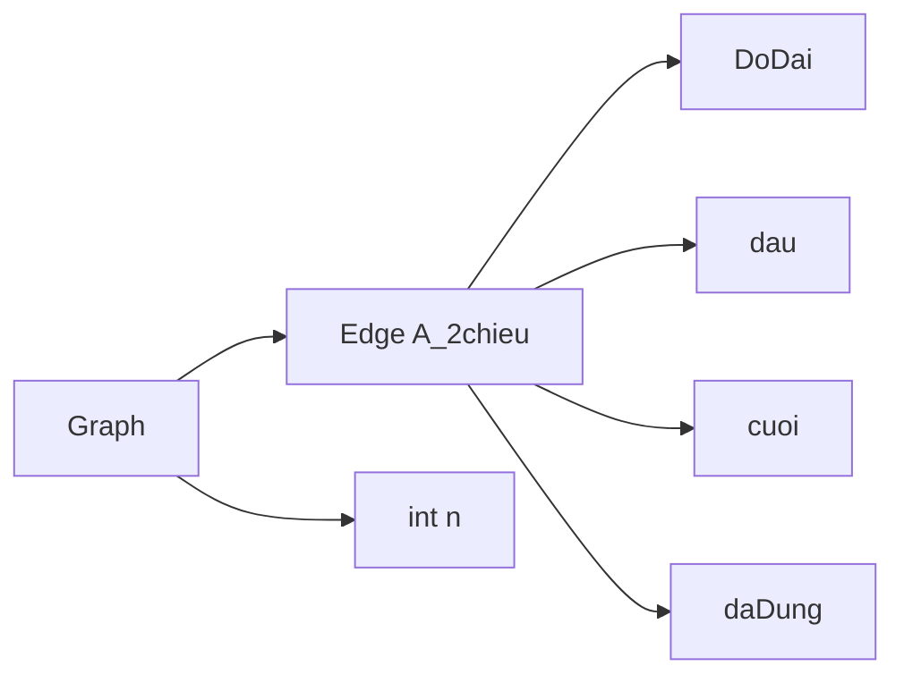

# TSP - BRANCH AND BOUND

#### Declaration

1. BranchAndBound
The solve function takes a graph G, an index i, the current node current, the partial cost p_cost, the pointer to the final cost final_cost, and an array of edges x.

- Initialize n to the number of vertices in the graph.
- Iterate over all possible next nodes (next) from the current node.
- Check if current is not equal to next and if the edge between them (G->E[current][next]) is not marked and if adding this edge does not create a cycle in the partial solution x.
- If the above conditions are met:
**a.** Calculate the cost of the current partial solution by adding the length of the edge from current to next to the partial cost p_cost.
**b.** Calculate a lower bound estimate lbound for the remaining cost using the lowerBound function.
**c.** If this lower bound is less than the current final cost, proceed to explore this path further.
**d.** Update the partial solution x with the chosen edge (G->E[current][next]).
**e.** Mark the chosen edge and its reverse to avoid revisiting them.
**f.** If i indicates that all edges have been considered (i == n-2), update the final result if the current cost is better.
**g.** Otherwise, recursively call the solve function with updated parameters to explore further.
After exploring all possible paths from the current node, unmark the chosen edge and its reverse for backtracking.

2. Funtions
- isCircle()
- lowerBound()
- updateResult()